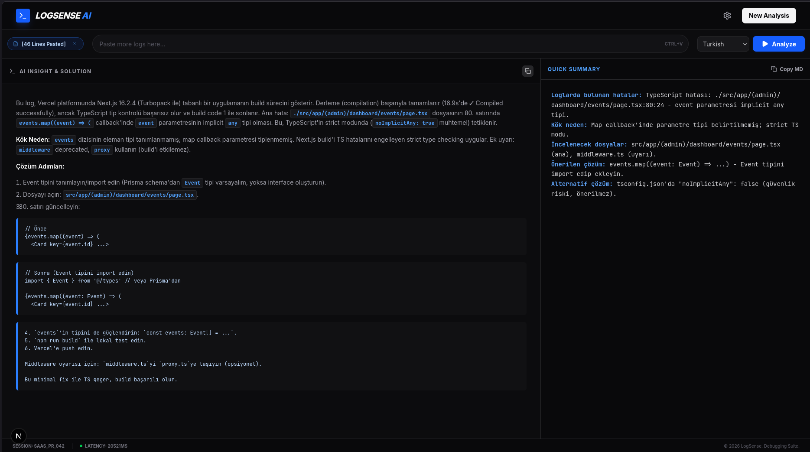
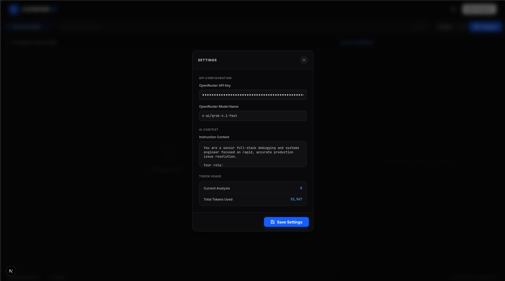

   # LogSense AI

   **AI-powered log and error analysis tool**

   Merges pasted log blocks, analyzes them via OpenRouter, and generates both detailed solutions and quick summaries.
</div>

<div align="center">
   
</div>

---

## 🚀 Project Overview

`LogSense AI` is a Next.js application designed specifically for backend/frontend runtime issues, build failures, and stack trace analysis.

The application:
- Combines multiple log blocks into a single analysis.
- Returns results in two formats:
   - **Detailed analysis** (`detailed_analysis`)
   - **Quick summary** (`quick_summary`)
- Supports multilingual output (selectable from the UI).
- Tracks token usage per session.
- Stores settings (prompt context, API key, model name) in a local file.

---

## ✨ Features

- **Multi-log input:** Each pasted block is labeled separately.
- **Language selection:** Analysis language can be changed from the UI.
- **Model flexibility:** You can change the OpenRouter model name from settings.
- **Customizable system instructions:** Save custom context/prompt to improve analysis quality.
- **Markdown rendering:** Results are displayed in readable Markdown format.
- **Copy actions:** Detailed and summary outputs can be copied separately.
- **Latency and token metrics:** Visible for performance and cost tracking.
- **Favicon support:** Browser tab icon is served from `public/explorer-icon.png`.

---

## 🧱 Tech Stack

### Application
- **Next.js 15** (App Router)
- **React 19** + **TypeScript**
- **Tailwind CSS 4**

### UI / Utility Libraries
- `lucide-react` (icons)
- `react-markdown` + `remark-gfm` (Markdown rendering)
- `clsx` + `tailwind-merge` (`cn` utility)

### AI Integration
- **OpenRouter Chat Completions API** (called from `/api/analyze`)

---

## 📁 Project Structure

```text
.
├─ app/
│  ├─ api/
│  │  ├─ analyze/route.ts      # Log analysis endpoint
│  │  └─ settings/route.ts     # Read/save settings endpoint
│  ├─ globals.css              # Global theme + markdown styles
│  ├─ layout.tsx               # Metadata, fonts, favicon
│  └─ page.tsx                 # Main UI and client flow
├─ components/
│  └─ ui/                      # Reusable UI parts (button/card/textarea)
├─ hooks/
│  └─ use-mobile.ts
├─ lib/
│  └─ utils.ts                 # cn() utility
├─ profile/
│  └─ configuration.txt        # File where runtime settings are stored as JSON
├─ public/
│  └─ explorer-icon.png        # Favicon
└─ README.md
```

---

## ⚙️ Setup

### Requirements
- Node.js 20+ (recommended)
- npm

### 1) Install dependencies

```bash
npm install
```

### 2) Start the development server

```bash
npm run dev
```

Default app URL: `http://localhost:3000`

### 3) Enter API key and model in the app

After opening the app:

1. Click the **Settings** icon (top-right).
2. Enter your **OpenRouter API Key**.
3. Enter the **model name** you want to use (e.g. `x-ai/grok-4.1-fast`).
4. Click **Save Settings**.

> No `.env` file is required for this workflow.

### 4) Configure **Instruction Context** (Highly Recommended)

In the same **Settings** panel, paste a configuration text into the **Instruction Context** field.

**Recommended configuration text:**

```text
You are a senior full-stack debugging and systems engineer focused on rapid, accurate production issue resolution.

Your role:
Analyze logs, stack traces, runtime errors, build failures, infrastructure issues, database problems, deployment regressions, and performance bottlenecks. Prioritize root-cause analysis over generic advice.

Response format:
- Diagnosis
- Evidence
- Most Likely Root Cause
- Fix Options (Recommended + Alternatives)
- Verification
- Prevention
```

> ⚠️ **Why this matters:** The quality and consistency of analysis heavily depends on this configuration text. A strong Instruction Context gives you more precise root-cause analysis, more actionable fixes, and less generic AI output.

> ℹ️ This content is saved via the settings API and persisted in `profile/configuration.txt`.

<div align="center">
   
</div>

---

## 🧪 Commands

```bash
npm run dev     # local development
npm run build   # production build
npm run start   # production server
npm run lint    # eslint check
```

---

## 🔌 API Endpoints

### `POST /api/analyze`

Triggers log analysis.

**Body**

```json
{
   "logs": "string (required)",
   "instructions": "string (optional)",
   "apiKey": "string (optional)",
   "modelName": "string (optional)",
   "language": "string (optional, default: Turkish)"
}
```

**Successful Response**

```json
{
   "result": {
      "detailed_analysis": "...",
      "quick_summary": "..."
   },
   "usage": {
      "total_tokens": 1234,
      "prompt_tokens": 900,
      "completion_tokens": 334
   }
}
```

**Error Cases**
- `400`: missing `logs`
- `500`: missing API key / unexpected error
- `4xx/5xx`: upstream OpenRouter errors

### `GET /api/settings`

Returns settings from `profile/configuration.txt`. If the file does not exist, returns empty defaults:

```json
{
   "instructions": "",
   "apiKey": "",
   "modelName": ""
}
```

### `POST /api/settings`

Writes settings as JSON to `profile/configuration.txt`.

---

## 🖥️ Application Flow

1. User pastes log blocks into the input.
2. The UI merges logs in `--- Log Block N ---` format.
3. A `POST /api/analyze` request is sent.
4. Backend sends system prompt + user instructions + log content to OpenRouter.
5. Returned JSON is parsed and shown in the UI:
   - Left panel: detailed analysis
   - Right panel: quick summary
6. Token usage accumulates in localStorage (`totalTokens`).

---

## 🛡️ Security Notes

- Since API keys can be stored in `profile/configuration.txt`, do not commit this file to the repository.
- Mask sensitive data (tokens, passwords, personal data) in logs before sharing.
- In production, managing API keys via server environment variables is safer.

---

## 🧭 Known Notes

- Running `npm run lint` may currently report existing `react-hooks/set-state-in-effect` warnings/errors (`app/page.tsx`, `hooks/use-mobile.ts`).
- In `next.config.ts`, ESLint is disabled during build (`ignoreDuringBuilds: true`).

---

## 🚀 Deploy

The app follows the standard Next.js deployment flow.

At minimum, ensure the following variable is defined on the target platform:

```bash
OPENROUTER_API_KEY=...
```

Since `next.config.ts` includes `output: 'standalone'`, it is also suitable for containerized deployment scenarios.

---

## 🤝 Contributing

If you want to contribute:

1. Fork the repository
2. Create a new branch
3. Make your changes
4. Pass build/lint checks
5. Open a PR

---

## 📄 License

No license file is currently visible in this repository. If you plan open-source distribution, adding a `LICENSE` file is recommended.
